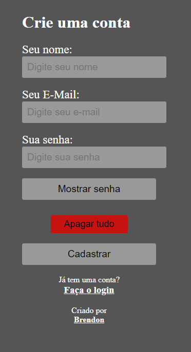

# Validador de Formulário personalizado

Este projeto é um validador de formulário com mensagens personalizadas caso algo preenchido esteja fora do desejado. Trazendo uma presença mais agradável. 
Consegui praticar mais da parte dos atributos, for loop e também o uso do switch.

#

Tela inicial 

Exibindo quais campos são obrigatórios 

Exibindo erros ao preencher os campos 

Erros corrigidos e utilização do botão "Mostrar senha" 

